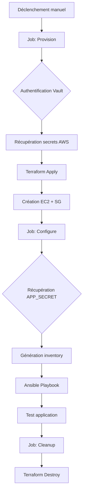

# Pipeline IaC - CI/CD avec GitHub Actions, Terraform, Ansible et Vault

[](https://github.com/features/actions) [](https://www.terraform.io/) [](https://www.ansible.com/) [](https://www.vaultproject.io/) [](https://aws.amazon.com/) [](https://www.docker.com/)

> Pipeline CI/CD complet qui automatise le déploiement d'une application Flask sur AWS EC2 avec gestion sécurisée des secrets via HashiCorp Vault.

## Table des matières

- [Vue d'ensemble](#-vue-densemble)
- [Architecture](#-architecture)
- [Fonctionnalités](#-fonctionnalit%C3%A9s)
- [Démarrage rapide](#-d%C3%A9marrage-rapide)
- [Configuration](#-configuration)
- [Utilisation](#-utilisation)
- [Documentation](#-documentation)
- [Dépannage](#-d%C3%A9pannage)
- [Contribution](#-contribution)

## Vue d'ensemble

Ce projet implémente un pipeline Infrastructure as Code (IaC) professionnel qui démontre des pratiques DevOps modernes :

- **Provisionnement automatique** de l'infrastructure AWS avec Terraform
- **Configuration automatisée** des serveurs avec Ansible
- **Déploiement conteneurisé** avec Docker
- **Gestion sécurisée des secrets** avec HashiCorp Vault et OIDC
- **Pipeline multi-jobs** avec GitHub Actions
- **Destruction automatique** des ressources (infrastructure éphémère)

### Démonstration

Vidéo complète d'exécution du workflow :


https://github.com/user-attachments/assets/14faaac6-0c25-4bdc-8162-7b698fb2fd4d


## Architecture



### Flux de travail

1. **Authentification** : GitHub Actions s'authentifie à Vault via OIDC/JWT
2. **Secrets** : Récupération des credentials AWS et APP_SECRET depuis Vault
3. **Provision** : Terraform crée l'infrastructure AWS (EC2, Security Group, Key Pair)
4. **Configure** : Ansible installe Docker et déploie l'application
5. **Deploy** : L'application Flask tourne dans un conteneur Docker qui se trouve dans l'instance EC2
6. **Cleanup** : Terraform détruit automatiquement toutes les ressources après réussite des tests de fonctionnement de l'application

## Fonctionnalités

### Pipeline

- **Multi-jobs** : Séparation claire des responsabilités (provision, configure, cleanup)
- **Approval gates** : Environnement production protégé
- **Artifacts** : Partage de données entre jobs (SSH keys, Terraform state)
- **Error handling** : Cleanup exécuté même en cas d'échec
- **Durée** : ~5 minutes du début à la fin

### Sécurité

- **Zero-trust** : Aucun secret hardcodé dans le code
- **OIDC Authentication** : Pas de credentials statiques pour Vault
- **Temporary tokens** : Tokens Vault avec TTL de 1h
- **Least privilege** : Policies Vault restrictives

### Infrastructure

- **AWS EC2** : Instance t3.micro (Free Tier)
- **Security Group** : Ports 22 (SSH) et 5000 (App) ouverts
- **Dynamic SSH keys** : Générées par Terraform à chaque déploiement
- **Ephemeral** : Infrastructure créée et détruite automatiquement

## Démarrage rapide

### Prérequis

- Compte GitHub
- Compte AWS (Free Tier)
- Compte HashiCorp Cloud Platform (HCP)


**Étapes : 
1. Forker le dépôt
	
2. Configurer Vault (voir section Configuration)
	
3. Ajouter VAULT_ADDR dans GitHub
	Settings → Secrets and variables → Actions → Variables
	Name: VAULT_ADDR
	Value: https://votre-vault-url.hashicorp.cloud:8200
4. Lancer le workflow

Actions → IaC Pipeline AWS → Run workflow → Approve deployment


## Configuration

### 1. AWS

Créer un utilisateur IAM avec `AmazonEC2FullAccess` et récupérer les credentials.

### 2. HashiCorp Vault

- Création d'un compte sur HashiCorp Cloud Portal
- Création s'un secret engine
- Configuration complète de Vault :
```bash
# Installer Vault CLI
brew install vault  # macOS
# ou
sudo apt-get install vault  # Linux

# Configurer l'accès
export VAULT_ADDR="https://votre-vault-url.hashicorp.cloud:8200"
export VAULT_TOKEN="votre-admin-token"
export VAULT_NAMESPACE="admin"

# Activer JWT Auth
vault auth enable jwt

# Configurer JWT
vault write auth/jwt/config \
  bound_issuer="https://token.actions.githubusercontent.com" \
  oidc_discovery_url="https://token.actions.githubusercontent.com"

# Créer la policy
vault policy write github-actions - <<EOF
path "secret/data/secret/iac/app" {
  capabilities = ["read"]
}
path "secret/data/secret/iac/aws" {
  capabilities = ["read"]
}
EOF

# Créer le rôle (REMPLACER username/repo)
cat > /tmp/github-role.json <<'EOF'
{
  "role_type": "jwt",
  "bound_audiences": ["https://github.com/VOTRE-USERNAME"],
  "bound_claims_type": "glob",
  "bound_claims": {
    "sub": "repo:VOTRE-USERNAME/VOTRE-REPO:*"
  },
  "user_claim": "actor",
  "policies": ["github-actions"],
  "ttl": "1h"
}
EOF

curl --header "X-Vault-Token: $VAULT_TOKEN" \
     --header "X-Vault-Namespace: admin" \
     --request POST \
     --data @/tmp/github-role.json \
     $VAULT_ADDR/v1/auth/jwt/role/github-actions
```

- Créer les secrets via l'interface HCP Vault :
	- `secret/secret/iac/app` → `app_secret: "votre-secret"`
	- `secret/secret/iac/aws` → `access_key_id`, `secret_access_key`, `region`

### 3. GitHub

```bash
# Ajouter la variable (pas secret)
Settings → Secrets and variables → Actions → Variables
Name: VAULT_ADDR
Value: https://votre-vault-url.hashicorp.cloud:8200

# Créer l'environnement
Settings → Environments → New environment
Name: production
Protection rules: Required reviewers (optionnel)
```

## Utilisation

### Lancer le déploiement

1. Aller dans **Actions** → **IaC Pipeline AWS**
2. Cliquer sur **Run workflow**
3. Approuver le déploiement dans l'environnement `production`

### Observer l'exécution

- **Job Provision** : ~1 min (création infrastructure AWS)
- **Job Configure** : ~4 min (installation Docker, déploiement app)
- **Job Cleanup** : ~1-2 min (destruction infrastructure)

### Accéder à l'application

L'URL s'affiche dans les logs du job `configure` :

```
Access it at: http://X.X.X.X:5000
```

Ouvrir cette URL dans un navigateur pour voir l'application Flask avec le secret Vault affiché ! 

## Documentation

- Documentation complète - Guide détaillé avec toutes les explications
- Guide de dépannage - Solutions aux problèmes courants

##  Technologies

|Technologie|Usage|
|---|---|
|**GitHub Actions**|Orchestration du pipeline CI/CD|
|**Terraform**|Provisionnement infrastructure (IaC)|
|**Ansible**|Configuration management|
|**HashiCorp Vault**|Gestion sécurisée des secrets|
|**AWS EC2**|Infrastructure cloud (Free Tier)|
|**Docker**|Conteneurisation de l'application|
|**Python/Flask**|Application web de démonstration|

---

_Dernière mise à jour : Décembre 2025_
